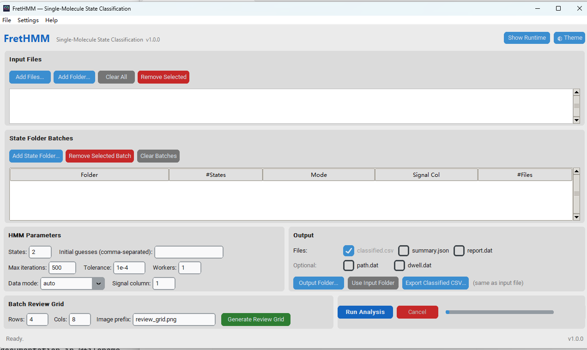

# FretHMM

单分子时间序列隐马尔可夫模型（HMM）状态分类工具。受 [HaMMy](https://github.com/Ha-SingleMoleculeLab/HaMMy) 启发，使用 Python 从零重写，支持跨平台运行、批量处理和 GUI 交互。

> **English:** FretHMM is a single-molecule time-series Hidden Markov Model (HMM) state classification tool. Inspired by [HaMMy](https://github.com/Ha-SingleMoleculeLab/HaMMy), it is rewritten from scratch in Python with cross-platform support, batch processing, and a full GUI. [中文文档见下方 ↓](#功能概览)

## 功能概览

| 特性 | 说明 |
|------|------|
| HMM 引擎 | Baum-Welch 训练 + Viterbi 解码（基于 hmmlearn），支持自定义初始猜测值 |
| 数据模式 | 自动检测 / 单通道信号 / 双通道 Donor-Acceptor（自动计算 FRET 效率） |
| 批量处理 | 多文件并行（`ProcessPoolExecutor`），支持目录扫描与多进程 |
| Review Grid | 批量分类 + 分页多面板 PNG 可视化审查，快速筛查分类质量 |
| 低态尾部裁剪 | 两遍 HMM 拟合，自动识别并裁剪持续低信号尾部（如光漂白态） |
| CLI | `run`、`tdp`、`review-grid`、`gui` 四个子命令 |
| GUI | CustomTkinter 界面，深色/浅色主题，中英文切换，后台线程分析，支持批量 review grid 导出 |
| 输出格式 | `*_classified.csv`、`*_summary.json`、`*report.dat`、`*path.dat`、`*dwell.dat`（GUI 可勾选） |
| TDP | 转换密度图（Transition Density Plot）可视化 + 高斯速率拟合 |
| 打包 | PyInstaller 一键构建 Windows 可执行文件（支持目录模式 / `--onefile` 单文件模式） |

## 安装

```bash
git clone https://github.com/Caizhaohui/FretHMM.git
cd FretHMM
pip install -e .
```

**运行依赖：**

- Python >= 3.10
- NumPy >= 1.24
- SciPy >= 1.10
- hmmlearn >= 0.3.0
- matplotlib >= 3.7（TDP 和 Review Grid 可视化需要）
- customtkinter >= 5.2.0（GUI 需要）

**可选依赖：**

```bash
pip install -e ".[dev]"    # 安装 pytest 测试框架
pip install -e ".[gui]"    # 安装 PyInstaller 打包工具
```

## 使用方法

### CLI

FretHMM 提供四个子命令：`run`（HMM 分析）、`review-grid`（可视化审查）、`tdp`（转换密度图）、`gui`（图形界面）。

#### run — HMM 状态分类

```bash
# 单文件分析（2 态，自动检测数据格式）
frethmm run --files trace.csv --states 2 --output-dir ./results/

# 批量处理目录下所有轨迹文件（4 个并行进程）
frethmm run --input-dir ./traces/ --states 5 --workers 4 --output-dir ./results/

# 同时指定多个文件
frethmm run --files trace1.csv trace2.csv trace3.csv --states 3 --output-dir ./results/

# 提供初始猜测值（适用于状态间距较小的情况）
frethmm run --files data.csv --states 2 --guesses "0.3,0.7"

# 指定单通道模式及信号列
frethmm run --files data.csv --states 2 --mode single_channel --signal-column 1

# 使用低态尾部裁剪（裁剪持续 ≥ 5 秒的低信号尾部后重新分类）
frethmm run --files trace.csv --states 2 --low-state-tail-trim-seconds 5.0

# 只输出主结果 classified.csv
frethmm run --files data.csv --states 2 --classified-only

# 详细输出模式（显示所有警告信息）
frethmm run --files data.csv --states 3 -v
```

**`run` 子命令参数：**

| 参数 | 默认值 | 说明 |
|------|--------|------|
| `--files` | — | 指定一个或多个轨迹文件路径（与 `--input-dir` 二选一，必填） |
| `--input-dir` | — | 指定输入目录，自动扫描其中所有轨迹文件（与 `--files` 二选一，必填） |
| `--output-dir` | — | 输出目录（默认与输入文件同目录） |
| `--states` | 2 | HMM 状态数 |
| `--guesses` | 无 | 逗号分隔的初始信号猜测值，数量须与 `--states` 一致 |
| `--max-iter` | 500 | Baum-Welch 最大迭代次数 |
| `--tol` | 1e-4 | 收敛容差 |
| `--workers` | 1 | 并行工作进程数（>1 时启用多进程批处理） |
| `--mode` | auto | 数据模式：`auto`（自动检测）/ `paired_channel`（双通道）/ `single_channel`（单通道） |
| `--signal-column` | 1 | 单通道模式下选择的信号列索引（1-based，第 1 列为 Time 之后的列） |
| `--low-state-tail-trim-seconds` | 无 | 低态尾部裁剪阈值（秒），启用两遍拟合（详见[数据过滤](#数据过滤低态尾部裁剪)） |
| `--classified-only` | 关闭 | 仅输出 `*_classified.csv`，不写出 `summary/report/path/dwell` |
| `-v` / `--verbose` | 关闭 | 详细输出模式，显示所有警告 |

**批量处理说明：**

- `--input-dir` 会扫描目录下所有 `.csv`、`.dat`、`.txt`、`.tsv` 文件，自动跳过 `*report.dat`、`*path.dat`、`*dwell.dat`、`*_classified.csv`、`*_summary.json` 等输出文件
- `--workers N` 启用多进程并行，N 为进程数，建议不超过 CPU 核心数
- 批量过程中单个文件出错不会中断整体流程，错误信息会打印到终端

#### review-grid — 批量可视化审查

```bash
# 基本用法：生成 4×4 的 2 态审查图
frethmm review-grid --input-dir ./traces/ --output review.png --states 2

# 自定义网格布局
frethmm review-grid --input-dir ./traces/ --output review.png --states 3 --rows 5 --cols 6

# 指定初始猜测值，同时输出 classified CSV 到指定目录
frethmm review-grid --input-dir ./traces/ --output review.png --states 2 \
    --guesses "0.2,0.8" --output-dir ./classified/

# 结合低态尾部裁剪
frethmm review-grid --input-dir ./traces/ --output review.png --states 2 \
    --low-state-tail-trim-seconds 5.0

# 4 个并行进程加速批量分类
frethmm review-grid --input-dir ./traces/ --output review.png --states 2 \
    --workers 4 --rows 4 --cols 8
```

**`review-grid` 子命令参数：**

| 参数 | 默认值 | 说明 |
|------|--------|------|
| `--input-dir` | — | 输入轨迹文件目录（必填） |
| `--output` | — | 输出 PNG 路径（必填，如 `review.png`） |
| `--output-dir` | 无 | 可选，用于存放 classified CSV 侧输出 |
| `--states` | 2 | HMM 状态数 |
| `--guesses` | 无 | 逗号分隔的初始信号猜测值 |
| `--max-iter` | 500 | Baum-Welch 最大迭代次数 |
| `--tol` | 1e-4 | 收敛容差 |
| `--workers` | 1 | 并行工作进程数 |
| `--mode` | auto | 数据模式：auto / paired_channel / single_channel |
| `--signal-column` | 1 | 单通道模式下的信号列索引 |
| `--low-state-tail-trim-seconds` | 无 | 低态尾部裁剪阈值（秒） |
| `--rows` | 4 | 每页面板行数 |
| `--cols` | 4 | 每行面板数 |

**分页说明：** 当轨迹数量超过 `rows × cols` 时，自动生成多页图片，文件名格式为 `review_page_01.png`、`review_page_02.png` 等。每个面板上方叠加显示原始信号（灰色）与 HMM 分类信号（红色），标题标注文件名、log-likelihood 和状态均值。拟合有警告的轨迹会以橙色边框高亮标记。

#### tdp — 转换密度图

```bash
# 从输出目录中的 report 文件生成转换密度图（交互窗口）
frethmm tdp --input-dir ./results/ --exposure 0.1

# 保存为图片文件
frethmm tdp --input-dir ./results/ --exposure 0.1 --output tdp.png

# 只显示前 N 个状态（按转移频次排序）
frethmm tdp --input-dir ./results/ --exposure 0.1 --states 3 --output tdp.png
```

**`tdp` 子命令参数：**

| 参数 | 默认值 | 说明 |
|------|--------|------|
| `--input-dir` | — | 包含 `*report.dat` 文件的目录（必填） |
| `--exposure` | 0.1 | 每帧曝光时间（秒），用于速率计算 |
| `--states` | 无 | 仅显示前 N 个状态（按转移频次排序） |
| `--output` | 无 | 输出图片路径（如 `tdp.png`），不指定则弹出交互窗口 |

#### gui — 图形界面

```bash
frethmm gui
```

GUI 界面截图（v1.0.0，含批量 review grid 审查区块）：



### GUI 使用说明

```bash
frethmm gui
```

- **菜单栏**：
  - **文件 (File)**：添加文件、添加文件夹、清除所有、退出
  - **设置 (Settings)**：HMM 参数设置对话框、语言切换（English / 中文）、界面风格（明亮 / 暗黑 / 跟随系统）
  - **帮助 (Help)**：关于对话框
- **文件选择**：通过按钮或菜单选择 `.csv` / `.dat` 轨迹文件，或指定输入目录批量处理
- **状态文件夹批处理**：新增"按状态分组的文件夹批处理"面板，可同时添加多个文件夹并为每个文件夹指定不同的状态数、数据模式和信号列
- **参数面板**：状态数、初始猜测值、最大迭代次数、容差、并行数、数据模式、信号列（与输出面板并排显示）
- **输出选项**：GUI 新增输出文件勾选框，可自由选择输出 classified.csv / summary.json / report.dat / path.dat / dwell.dat
- **Review Grid 区块**：专用区域设置行数、列数和输出文件名，点击"Generate Review Grid"按钮一键生成可视化审查图
- **运行面板**：可折叠的右侧运行面板（Show/Hide Runtime），实时显示分析状态、进度、运行汇总和最近输出路径
- **结果详情**：选中结果表格中的文件后，右侧面板展示完整拟合指标（状态数、log_prob、状态均值、sigma）和警告信息
- **进度条**：实时显示分析任务完成进度
- **结果表格**：分析完成后展示每个文件的拟合结果，颜色标识（绿色=成功，橙色=警告，红色=错误）
- **主题切换**：通过 Settings 菜单或标题栏 🌓 按钮切换 Light / Dark / System 主题
- **双语支持**：Settings → Language 实时切换 English / 中文界面
- **后台线程处理**：所有分析任务在后台线程执行，支持随时取消（Cancel 按钮）
- **日志面板**：彩色日志输出（蓝色标题、橙色警告、红色错误、绿色完成）
- **状态栏**：底部显示当前状态和版本号

## 可视化功能

### Review Grid 审查图

Review Grid 是面向人工审查的批量可视化工具，将目录中所有单分子轨迹的 HMM 分类结果渲染为一张（或多张）分页拼图。

**工作原理：**

1. 扫描输入目录中的所有轨迹文件
2. 对每个文件执行 HMM 状态分类
3. 将分类结果排列为 `rows × cols` 的网格面板
4. 每个面板叠加显示原始信号（灰色细线）和 HMM 分类信号（红色粗线）
5. 面板标题显示文件名、log-likelihood 和各状态均值
6. 拟合产生警告的轨迹以橙色边框标记，便于快速定位问题文件

**输出示例：**

```
review.png                     # 单页（轨迹数 ≤ rows × cols）
review_page_01.png             # 多页时自动编号
review_page_02.png
```

**典型工作流：**

```bash
# 1. 先用 review-grid 快速审查所有轨迹的分类质量
frethmm review-grid --input-dir ./traces/ --output review.png --states 2 --rows 4 --cols 8

# 2. 发现问题文件后，单独处理
frethmm run --files traces/bad_trace.csv --states 3 --guesses "0.1,0.5,0.9" -v

# 3. 审查通过后，批量输出完整结果
frethmm run --input-dir ./traces/ --states 2 --workers 4 --output-dir ./results/
```

### TDP 转换密度图

TDP（Transition Density Plot）从 HMM 分类生成的 `*report.dat` 文件中聚合所有分子的状态转移信息，绘制为散点密度图。

**图表构成：**

- **X 轴**：起始状态均值（Start state mean）
- **Y 轴**：终止状态均值（Stop state mean）
- **点大小和颜色**：编码转移次数（使用 `hot` 色谱，暖色 = 高频转移）
- **对角虚线**：自转移参考线

**`--states N` 过滤**：当混合不同状态数的数据集时，可通过此参数仅保留每个分子中转移频次最高的 N 个状态，便于跨数据集对比。

**速率分析**：除了可视化，FretHMM 还提供 `fit_gaussian_to_rates()` 编程接口，可对特定状态对之间的转移速率分布进行高斯拟合，提取平均速率和标准差。

## 数据过滤

### 低态尾部裁剪（Low-State Tail Trimming）

**问题背景：** 在单分子荧光实验中，轨迹末尾常出现持续的低信号段（如光漂白态、荧光分子失活）。这些尾部数据不属于感兴趣的构象状态，但会被 HMM 当作一个额外的低均值状态，干扰对真实状态的正确分类。

**两遍拟合工作流：**

```
┌─────────────┐     ┌──────────────┐     ┌─────────────┐
│  第一遍 HMM  │ ──→ │  定位最低态   │ ──→ │  数据截断    │
│  完整数据拟合 │     │  持续 ≥ 阈值  │     │  移除尾部    │
└─────────────┘     └──────────────┘     └─────────────┘
                                               │
                                               ▼
                                        ┌─────────────┐
                                        │  第二遍 HMM  │
                                        │  截断数据拟合 │
                                        └─────────────┘
```

1. **第一遍分类**：对完整轨迹进行 HMM 拟合，得到 Viterbi 状态路径
2. **定位最低态**：找到均值最低的状态
3. **检测持续段**：沿时间轴扫描，寻找最低态首次连续出现超过 `--low-state-tail-trim-seconds` 秒的位置
4. **截断数据**：在该时间点截断，丢弃尾部数据
5. **第二遍分类**：对截断后的数据重新运行 HMM 拟合，获得更干净的分类结果

> **注意：** 如果最低态从未连续出现超过阈值时间，则不执行截断，保留第一遍的分类结果。

**CLI 示例：**

```bash
# 单文件：裁剪持续 ≥ 5 秒的低信号尾部
frethmm run --files trace.csv --states 2 --low-state-tail-trim-seconds 5.0

# 批量处理：3 秒阈值，4 个并行进程
frethmm run --input-dir ./traces/ --states 3 --low-state-tail-trim-seconds 3.0 --workers 4

# 结合 Review Grid：先裁剪后审查
frethmm review-grid --input-dir ./traces/ --output review.png --states 2 \
    --low-state-tail-trim-seconds 5.0 --rows 4 --cols 8
```

**输出元数据：** 启用裁剪后，`*_summary.json` 会记录以下额外字段：

```json
{
  "low_state_tail_trim_seconds": 5.0,
  "low_state_tail_cutoff_time": 47.3,
  "low_state_tail_kept_frames": 473
}
```

- `low_state_tail_trim_seconds`：设定的裁剪阈值
- `low_state_tail_cutoff_time`：实际截断时间点（`null` 表示未触发裁剪）
- `low_state_tail_kept_frames`：裁剪后保留的帧数

**GUI 使用：** 在 GUI 的输出面板中找到"低态尾部裁剪（秒）"输入框，输入阈值后点击 Run Analysis 即可。所有文件和文件夹批处理任务都会应用该裁剪设置。

## 输入格式

程序自动检测文件格式（有无表头、分隔符类型、列数），支持以下两种模式：

**单通道模式**（CSV，带表头）：

```csv
Time,channel1
0,2820
1,2884
2,2570
```

多列信号时通过 `--signal-column` 选择指定列：

```csv
Time,channel1,channel2
0,2884,-5096
1,2884,1289
```

`--signal-column 1` 使用 `channel1` 列，`--signal-column 2` 使用 `channel2` 列。

**双通道 Donor/Acceptor 模式**（空格/Tab 分隔，3 列，无表头）：

```
<time>  <donor>  <acceptor>
```

此模式下自动计算 FRET 效率 `A/(D+A)` 作为 HMM 输入信号。

## 输出文件

每个输入文件生成以下输出：

| 文件 | 格式 | 说明 |
|------|------|------|
| `*_classified.csv` | CSV | 主输出：`time, classified_mean` 两列理想化轨迹 |
| `*_summary.json` | JSON | 状态均值、占比、转移矩阵、驻留统计、裁剪元数据、警告信息 |
| `*report.dat` | 文本 | 模型参数（状态数、均值、sigma、转移概率矩阵） |
| `*path.dat` | TSV | 原始信号通道 + FRET 信号 + 分类信号路径（每帧一行） |
| `*dwell.dat` | TSV | 驻留时间表：`<start_mean> <stop_mean> <frames_lasted>`（每个驻留段一行） |

## 项目结构

```
FretHMM/
├── frethmm/
│   ├── __init__.py              # 版本信息
│   ├── app/
│   │   ├── cli.py               # CLI 入口（run / tdp / review-grid / gui）
│   │   ├── gui.py               # CustomTkinter GUI
│   │   └── i18n.py              # 国际化（英文 / 中文，138 个翻译键）
│   ├── assets/
│   │   ├── frethmm.ico          # 应用图标
│   │   └── frethmm_logo.png     # 应用 Logo
│   ├── core/
│   │   ├── io.py                # 文件读写（轨迹读取 + 报告输出）
│   │   ├── model.py             # HMM 引擎（Baum-Welch + Viterbi + 低态裁剪）
│   │   ├── batch.py             # 多进程批处理器
│   │   └── postprocess.py       # 分类轨迹构建 + 驻留时间提取 + 转移统计
│   ├── domain/
│   │   └── models.py            # 数据模型（Config / Trace / Result / ExportOptions）
│   ├── formats/
│   │   └── report_parser.py     # report.dat 解析器
│   ├── legacy/
│   │   └── report_parser.py     # 旧版报告格式解析器
│   └── viz/
│       ├── review_grid.py       # Review Grid 批量可视化审查（分页拼图）
│       └── tdp.py               # 转换密度图可视化 + 高斯速率拟合
├── tests/
│   ├── fixtures/                # 回归测试基准数据
│   ├── test_io.py               # I/O 与报告解析测试
│   ├── test_review_grid.py      # Review Grid 可视化测试
│   └── test_golden.py           # CLI 回归测试
├── docs/
│   ├── images/                  # 截图
│   └── FretHMM-refactor-plan.md # 开发路线
├── pyproject.toml               # 项目配置
├── build_exe.py                 # PyInstaller 打包脚本
├── frethmm.spec                 # PyInstaller 规格文件
├── LICENSE                      # MIT License
└── README.md
```

## 测试

```bash
pip install -e ".[dev]"
pytest tests/ -v
```

## 打包为可执行文件

```bash
# 目录模式（默认，生成 dist/FretHMM/ 目录）
python build_exe.py

# 单文件模式（生成 dist/FretHMM.exe，便于分发）
python build_exe.py --onefile
```

构建产物为独立的 Windows GUI 可执行文件，无需 Python 环境。单文件模式体积较大但便于分发。

## 更新日志

### v1.1.0 (2026-06-09)

文档与发布基础设施更新：

- **README 增强**：新增可视化功能（Review Grid + TDP）详细说明、数据过滤（低态尾部裁剪）完整工作流文档、GUI 功能详细描述
- **LICENSE**：新增 MIT License 文件
- **版本同步**：`__init__.py` 与 `pyproject.toml` 版本号统一为 1.1.0
- **`.gitignore` 更新**：补充日志目录等排除规则

### v1.0.0 (2026-06-04)

面向人工审查的批量可视化发布版本：

- **批量 review grid CLI**：新增 `review-grid` 子命令，可对目录中的单分子轨迹批量分类并导出分页拼图总览
- **GUI/EXE review grid**：GUI 新增 `Batch Review Grid` 区块，支持从文件或文件夹直接生成分页审查图
- **分页拼图布局**：支持自定义 `rows x cols`，适合 `2-state`、`3-state` 等批量样本的人眼快速筛查
- **可视化审查增强**：每个子图叠加 raw signal 和 classified trace，并显示文件名、`log_prob`、`state means`

### v0.6.0 (2026-06-01)

GUI 界面布局优化与打包瘦身：

- **布局重构**：移除 ScrollableFrame，改用扁平布局；参数面板与输出面板并排显示，节省纵向空间
- **可折叠运行面板**：右侧运行面板默认隐藏，通过 "Show/Hide Runtime" 按钮切换显示，最大化主工作区
- **应用图标**：新增 `frethmm.ico` 和 `frethmm_logo.png` 资源文件，窗口标题栏和任务栏显示自定义图标
- **窗口尺寸调整**：默认尺寸从 1150×750 增至 1280×720，最小尺寸 1180×660
- **空态安全**：`_tree`、`_log_text` 等控件初始化为 `None`，所有访问前增加空检查，防止构建阶段异常
- **PyInstaller 打包瘦身**：精简 spec 文件，使用 `collect_data_files` + `collect_dynamic_libs` 替代 `collect_all`；排除 PyQt5 / matplotlib / pandas / pytest / torch 等未使用的包，显著减小 EXE 体积
- **`--onefile` 模式**：`build_exe.py` 新增 `--onefile` 参数，通过 `FRETHMM_ONEFILE` 环境变量控制生成单文件 EXE

### v0.5.0 (2026-06-01)

GUI 稳定性修复与导出选项增强：

- **`ExportOptions` 数据类**：新增 `ExportOptions` 域模型，支持精细控制每种输出文件的生成（classified_csv / summary_json / state_report / state_path / dwell_report）
- **GUI 输出文件勾选框**：在输出面板新增复选框，用户可自由选择需要输出的文件类型（classified.csv 始终输出）
- **Worker 错误处理增强**：后台线程异常现在输出完整 traceback 到日志面板和调试日志文件（`%LOCALAPPDATA%/FretHMM/frethmm-gui.log`）
- **全局异常钩子**：`sys.excepthook` 捕获主线程未处理异常，在 `console=False` 的 EXE 中也能弹出错误对话框
- **`_poll_queue` 修复**：消息处理异常不再导致轮询终止；移除 `is_alive()` 检查避免队列消息丢失
- **`_on_mode_changed` 修复**：CTkComboBox 的 `command` 回调签名从 `Event` 改为 `str`
- **PyInstaller 打包优化**：使用 `collect_all` + `copy_metadata` 完整收集 hmmlearn / sklearn / scipy / numpy / matplotlib 资源
- **测试**：新增 `TestProcessTraceFileExports` 单元测试

### v0.4.0 (2026-06-01)

GUI 现代化重构与 CLI 功能增强：

- **CustomTkinter 迁移**：GUI 从 tkinter/ttk 全面迁移到 CustomTkinter，支持明亮/暗黑/跟随系统三种界面风格
- **`--classified-only` 参数**：CLI 新增 `--classified-only` 开关，仅输出 `*_classified.csv`，跳过 summary/report/path/dwell 辅助文件
- **文件夹批处理面板**：GUI 新增"按状态分组的文件夹批处理"面板，可同时添加多个文件夹并为每个文件夹独立指定状态数、数据模式等参数
- **运行面板与结果详情**：GUI 新增右侧运行面板，实时展示分析状态、进度、运行汇总；选中结果行后展示完整拟合指标和警告信息
- **完成通知对话框**：分析完成后弹出汇总对话框，显示成功/警告/错误计数和最后输出路径
- **i18n 扩展**：新增约 30 条翻译条目，覆盖主题切换、文件夹批处理、运行面板、结果详情等全部新功能
- **测试**：新增 `test_cli_run_classified_only_writes_only_primary_csv` 回归测试
- **依赖**：新增 `customtkinter>=5.2.0`

### v0.3.0 (2026-06-01)

项目重构为 FretHMM，建立模块化架构：

- 模块化拆分为 `core` / `domain` / `app` / `formats` / `legacy` / `viz` 六个子包
- CLI 支持单文件（`--files`）和目录批量（`--input-dir`）两种处理模式，支持多进程并行（`--workers`）
- GUI 完整功能：菜单栏、参数设置对话框、中英文切换、后台线程分析、彩色日志
- 默认生成 `*_classified.csv`（`time, classified_mean`）和 `*_summary.json` 主输出
- 同时输出 `report / path / dwell` 格式文件
- TDP 转换密度图可视化 + 高斯速率拟合
- PyInstaller 一键构建 Windows GUI 可执行文件
- 回归测试覆盖（I/O、报告解析、CLI 端到端）

### v0.2.0 (2026-06-01)

GUI 重大更新：

- 新增菜单栏（File / Settings / Help）和独立参数设置对话框
- 新增多语言支持（i18n），英文和中文界面实时切换
- 现代化 UI 样式：平台自适应字体、自定义 ttk 主题、彩色日志、状态栏
- 启动速度优化：GUI 延迟导入重型库，后台预热
- 警告处理优化：捕获 HMM 拟合警告，GUI 中以橙色标识

### v0.1.0 (2026-05-30)

初始版本：

- 完整 HMM 分析流程（Baum-Welch 训练 + Viterbi 解码）
- CLI 工具（`run` / `tdp` / `gui` 子命令）
- tkinter GUI（文件选择、参数面板、进度条、结果表格、日志面板）
- 多进程批处理支持
- TDP 可视化
- PyInstaller GUI 打包脚本

## 许可证

[MIT License](LICENSE)
